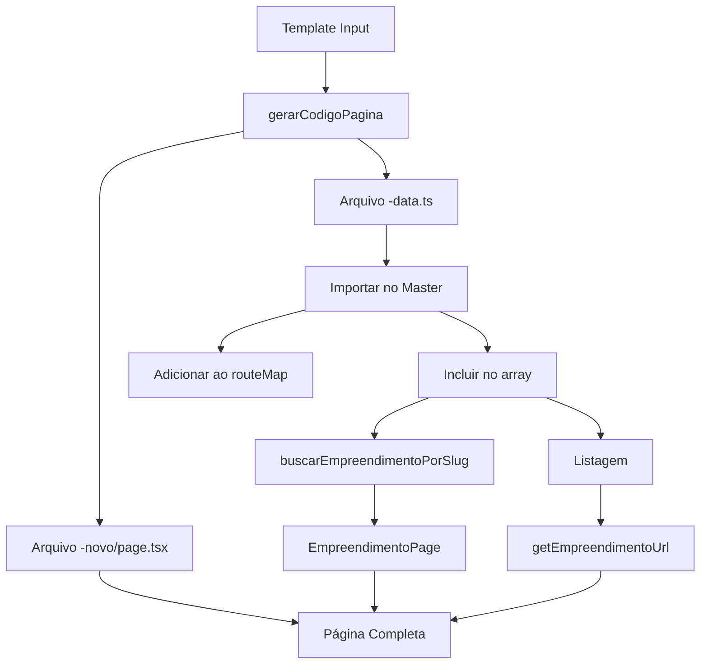

# 🏗️ ESTRUTURA COMPLETA FINAL - PÁGINAS COMPONENTIZADAS

## ✅ **ESTRUTURA IMPLEMENTADA**

### **🎯 PÁGINAS COMPLETAS COMO PADRÃO**
Todas as páginas de empreendimentos agora usam a **estrutura componentizada completa**:

```
app/
├── le-mont-novo/page.tsx         ✅ Completa (EmpreendimentoPage)
├── botanique-novo/page.tsx       ✅ Completa (EmpreendimentoPage)
├── jade-novo/page.tsx            ✅ Completa (EmpreendimentoPage)
├── obsidian-novo/page.tsx        ✅ Completa (EmpreendimentoPage)
└── icarai-novo/page.tsx          ✅ Completa (EmpreendimentoPage)
```

### **🔗 ROTEAMENTO ATUALIZADO**
```typescript
// lib/data/empreendimentos-master.ts
export function getEmpreendimentoUrl(slug: string): string {
  const routeMap: Record<string, string> = {
    "le-mont": "/le-mont-novo",
    "botanique": "/botanique-novo", 
    "jade": "/jade-novo",
    "obsidian": "/obsidian-novo",
    "icarai-parque-clube": "/icarai-novo",
  }
  
  return routeMap[slug] || `/${slug}-novo`
}
```

### **📋 COMPONENTE UNIFICADO**
Todas as páginas usam o **mesmo componente** (`EmpreendimentoPage`):
- ✅ **Header** com navegação interna
- ✅ **Hero** seção completa  
- ✅ **Sobre** o empreendimento
- ✅ **Informações** com sistema de abas
- ✅ **Galeria** de imagens
- ✅ **Plantas** e ficha técnica
- ✅ **Contato** integrado
- ✅ **Footer** padrão
- ✅ **Modal** de contato

---

## 🚀 **COMO FUNCIONA AGORA**

### **1. LISTAGEM DE EMPREENDIMENTOS**
```typescript
// components/empreendimentos-listing.tsx
import { getEmpreendimentoUrl } from "@/lib/data/empreendimentos-master"

// Os links agora apontam para páginas completas (-novo)
<Link href={getEmpreendimentoUrl(empreendimento.slug)}>
```

### **2. TEMPLATE ATUALIZADO**
```typescript
// lib/templates/novo-empreendimento-template.ts

// ✅ SEMPRE gera páginas -novo (completas)
caminhos: {
  pagina: `app/${slugKebab}-novo/page.tsx`,
  dados: `lib/data/${slugKebab}-data.ts`,
}

// ✅ SEMPRE usa EmpreendimentoPage
return <EmpreendimentoPage data={empreendimentoData} />
```

### **3. PÁGINAS GERADAS**
Todas seguem o mesmo padrão:
```typescript
import EmpreendimentoPage from "@/components/empreendimento/EmpreendimentoPage"
import { buscarEmpreendimentoPorSlug } from "@/lib/data/empreendimentos-master"

export default function EmpreendimentoPage() {
  const data = buscarEmpreendimentoPorSlug("slug")
  return <EmpreendimentoPage data={data} />
}
```

---

## 📝 **PROCESSO PARA NOVO EMPREENDIMENTO**

### **Passo 1: Usar o Template**
```typescript
const novoEmpreendimento: NovoEmpreendimentoInput = {
  nome: "Novo Empreendimento",
  slug: "novo-empreendimento", 
  localizacao: "Cidade - Estado",
  // ... demais dados
}

const codigo = gerarCodigoPagina(novoEmpreendimento)
```

### **Passo 2: Criar Arquivos**
```bash
# O template gera automaticamente:
app/novo-empreendimento-novo/page.tsx
lib/data/novo-empreendimento-data.ts
```

### **Passo 3: Adicionar ao Master**
```typescript
// lib/data/empreendimentos-master.ts

// 1. Importar os dados
import { novoEmpreendimentoData } from "./novo-empreendimento-data"

// 2. Adicionar ao routeMap
const routeMap: Record<string, string> = {
  // ... existing
  "novo-empreendimento": "/novo-empreendimento-novo",
}

// 3. Incluir no array master
export const empreendimentosMaster: Empreendimento[] = [
  // ... existing
  {
    ...converterTemplateParaEmpreendimento(novoEmpreendimentoData, 6),
    slug: "novo-empreendimento",
    destacado: true,
  },
]
```

### **Passo 4: Testar**
- ✅ Página acessível em `/novo-empreendimento-novo`
- ✅ Aparece na listagem `/empreendimentos` 
- ✅ Filtros funcionando
- ✅ Componente completo carregando

---

## 🔄 **FLUXO COMPLETO**



---

## 🎯 **VANTAGENS DA NOVA ESTRUTURA**

### **✅ Consistência Total**
- Todas as páginas usam o mesmo componente
- Mesmo layout e funcionalidades
- Experiência unificada

### **✅ Escalabilidade**
- Template gera páginas completas automaticamente
- Fácil adicionar novos empreendimentos
- Estrutura padronizada

### **✅ Manutenibilidade**
- Um componente para manter (`EmpreendimentoPage`)
- Dados centralizados no master
- Roteamento unificado

### **✅ SEO Otimizado**
- Páginas estáticas com metadata completa
- URLs amigáveis (`/nome-novo`)
- OpenGraph configurado

### **✅ Funcionalidades Completas**
- Sistema de abas para informações
- Modal de contato integrado
- Galeria responsiva
- Plantas interativas

---

## 📋 **PÁGINAS DISPONÍVEIS**

| Empreendimento | URL | Status |
|----------------|-----|--------|
| Le Mont | `/le-mont-novo` | ✅ Completa |
| Botanique | `/botanique-novo` | ✅ Completa |
| Jade | `/jade-novo` | ✅ Completa |
| Obsidian | `/obsidian-novo` | ✅ Completa |
| Icaraí | `/icarai-novo` | ✅ Completa |

---

## 🚀 **PRÓXIMOS PASSOS**

1. **✅ Estrutura implementada** - Páginas -novo como padrão
2. **✅ Template atualizado** - Sempre gera páginas completas
3. **✅ Roteamento unificado** - getEmpreendimentoUrl funcional
4. **✅ Listagem atualizada** - Aponta para páginas corretas

### **Opcional - Limpeza:**
```bash
# Remover páginas antigas se necessário
rm -rf app/empreendimento  # rota dinâmica antiga
```

---

## 💡 **REGRA DE OURO**

**SEMPRE use as páginas `-novo` como padrão.**

- ✅ Mais completas e componentizadas
- ✅ SEO otimizado 
- ✅ Funcionalidades avançadas
- ✅ Experiência consistente

**As páginas `-novo` são o futuro da estrutura de empreendimentos!** 🎯 